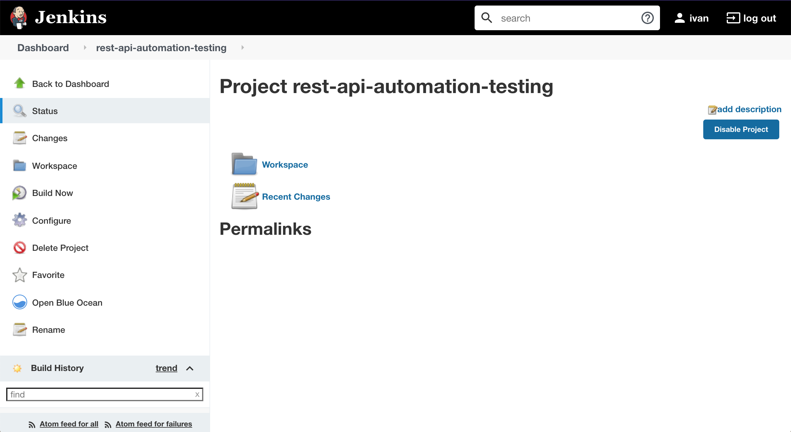

# postman-newman-jenkins

The goal of this project is to implement an **Automation Testing** for a REST API. We will use [`Postman`](https://www.getpostman.com), [`Newman`](https://github.com/postmanlabs/newman) (that is the command line Collection Runner for Postman) and [`Jenkins`](https://jenkins.io). The REST API to be tested will be [`ReqRes`](https://reqres.in), that is a fake online REST API. 

## Prerequisites

- [`Postman`](https://www.postman.com/downloads/)
- [`Docker`](https://www.docker.com/)
- [`Docker-Compose`](https://docs.docker.com/compose/install/)

## Test Postman Collection in Host Machine

- Open a terminal and make sure you are inside `postman-newman-jenkins` root folder

- Execute the following command. I will run `Newman` docker container using the `Postman` collection present in `postman` folder.
  ```
  docker run -t --rm --name newman \
    -v $PWD/postman:/etc/newman \
    postman/newman:5.1.1-alpine run ReqRes.postman_collection.json -g ReqRes.postman_globals.json
  ```
  
- In `postman` folder, there are two JSON files that configure some test cases and environment variables to run them. You can edit them by using `Postman`. 

## Start environment

- In a terminal, make sure you are inside `postman-newman-jenkins` root folder

- Export to `DOCKER_PATH` environment variable the docker path in host machine
  ```
  export DOCKER_PATH=$(which docker)
  ```

- Run the command below
  ```
  docker-compose up -d
  ```
  
  - A new image `docker.mycompany.com/postman-newman-jenkins:2.244-slim` is build from the `Jenkins` base image `jenkins/jenkins:2.244-slim`.
  
    > _"We need to give the jenkins user sudo privileges in order to be able to run Docker commands inside the container. Alternatively we could have added the jenkins user to the Docker group, which avoids the need to prefix all Docker commands with ‘sudo’, but is non-portable due to the changing gid of the group"_ [1]

  - To rebuild this image you must use `docker-compose build` or `docker-compose up --build`

- Wait a bit so that `jenkins` container is `Up (healthy)`. To check it run
  ```
  docker-compose ps
  ```

## Configure Jenkins

- In a terminal, get the `Jenkins` installation password by running the following command
  ```
  docker logs jenkins
  ```

  You should see something similar to
  ```
  *************************************************************
  *************************************************************
  *************************************************************
  
  Jenkins initial setup is required. An admin user has been created and a password generated.
  Please use the following password to proceed to installation:
  
  1b5964b8c7a648e584a994fbb293c05f
  
  This may also be found at: /var/jenkins_home/secrets/initialAdminPassword
  
  *************************************************************
  *************************************************************
  *************************************************************
  ```

- Access `Jenkins` at http://localhost:9090

- Inform the installation password and click on `Continue`

- Select `Install suggested plugins` (default installation). Wait for it to complete.

- In the screen `Create First Admin User`, create an account for you informing a username, password, etc. Then, click on `Save and Continue` button

- Keep the `Jenkins URL` as it is, i.e, `http://localhost:9090/`, and click on `Save and Finish` button

- **Done**, Jenkins is ready! Click on `Start using Jenkins`

## Configure an Automation Project in Jenkins 

- If you are not in Jenkins website, access it at http://localhost:9090/

- Provide the username and password that you created while [configuring Jenkins](#Configure Jenkins) 

- On the main Jenkins interface, click on `New item` on the menu.

- Enter a name, for instance, `rest-api-automation-testing`

- Select `Freestyle project` and click on `OK` button. 

- On the next screen, go to `Build` section. Click on `Add build step` and select `Execute shell`

- Fill the `Command` field with the command below
  ```
  sudo docker run --rm postman/newman:5.1.1-alpine \
  run "https://raw.githubusercontent.com/ivangfr/postman-newman-jenkins/master/postman/ReqRes.postman_collection.json" \
  -g "https://raw.githubusercontent.com/ivangfr/postman-newman-jenkins/master/postman/ReqRes.postman_globals.json" \
  --disable-unicode --color off
  ```

- Click on `Save` button at the bottom of the page

- Your Jenkins project is created. You should see something like

  

- In order to run the project, click on `Build Now` menu item on the left.
  
  > **Note:** The test cases are a bit strict. They require that the response time must be below 1000 ms. So, depending on how fast `ReqRes` online REST API replies to you request, maybe some test cases will fail and, consequently, the build will fail.

- To see the execution results, click on the red or blue balls that appears inside `Build History` (section on the left) everytime you build the Jenkins project. You should get an output like
  ```
  Started by user admin
  Running as SYSTEM
  Building in workspace /var/jenkins_home/workspace/rest-api-automation-testing
  [rest-api-automation-testing] $ /bin/sh -xe /tmp/jenkins5824478514633252264.sh
  + sudo docker run --rm postman/newman:5.1.1-alpine run https://raw.githubusercontent.com/ivangfr/postman-newman-jenkins/master/postman/ReqRes.postman_collection.json -g https://raw.githubusercontent.com/ivangfr/postman-newman-jenkins/master/postman/ReqRes.postman_globals.json --disable-unicode --color off
  newman
  
  ReqRes
  
  Root Get List of Users
    GET https://reqres.in/api/users [200 OK, 1.91KB, 337ms]
    Pass  Status code is 200
    Pass  Content-Type is present
    Pass  Response time is less than 1000ms
    Pass  Page Schema is valid
    Pass  Field values
  
  Root Get Single User
    GET https://reqres.in/api/users/2 [200 OK, 947B, 46ms]
    Pass  Status code is 200
    Pass  Content-Type is present
    Pass  Response time is less than 1000ms
    Pass  User Schema is valid
    Pass  Field values
  
  Root Get Nonexistent User
    GET https://reqres.in/api/users/20 [404 Not Found, 545B, 165ms]
    Pass  Status code is 404
    Pass  Content-Type is present
    Pass  Response time is less than 1000ms
  
  Root Post User
    POST https://reqres.in/api/users [201 Created, 573B, 153ms]
    Pass  Status code is 201
    Pass  Content-Type is present
    Pass  Response time is less than 1000ms
    Pass  User Schema is valid
  
  Root Put User
    PUT https://reqres.in/api/users/2 [200 OK, 610B, 154ms]
    Pass  Status code is 200
    Pass  Content-Type is present
    Pass  Response time is less than 1000ms
    Pass  User Schema is valid
  
  Root Delete User
    DELETE https://reqres.in/api/users/2 [204 No Content, 444B, 86ms]
    Pass  Status code is 204
    Pass  Response time is less than 1000ms
  
  --------------------------------------------------------------------
  |                         |           executed |            failed |
  --------------------------+--------------------+--------------------
  |              iterations |                  1 |                 0 |
  --------------------------+--------------------+--------------------
  |                requests |                  6 |                 0 |
  --------------------------+--------------------+--------------------
  |            test-scripts |                 12 |                 0 |
  --------------------------+--------------------+--------------------
  |      prerequest-scripts |                  6 |                 0 |
  --------------------------+--------------------+--------------------
  |              assertions |                 23 |                 0 |
  --------------------------------------------------------------------
  | total run duration: 1428ms                                       |
  --------------------------------------------------------------------
  | total data received: 1.71KB (approx)                             |
  --------------------------------------------------------------------
  | average response time: 156ms [min: 46ms, max: 337ms, s.d.: 91ms] |
  --------------------------------------------------------------------
  Finished: SUCCESS
  ```

## Shutdown

- In a terminal, make sure you are inside `postman-newman-jenkins` root folder

- To stop and remove docker-compose container, network and volumes run
  ```
  docker-compose down -v
  ```

## References

[1] Running Docker in Jenkins (in Docker): https://container-solutions.com/running-docker-in-jenkins-in-docker